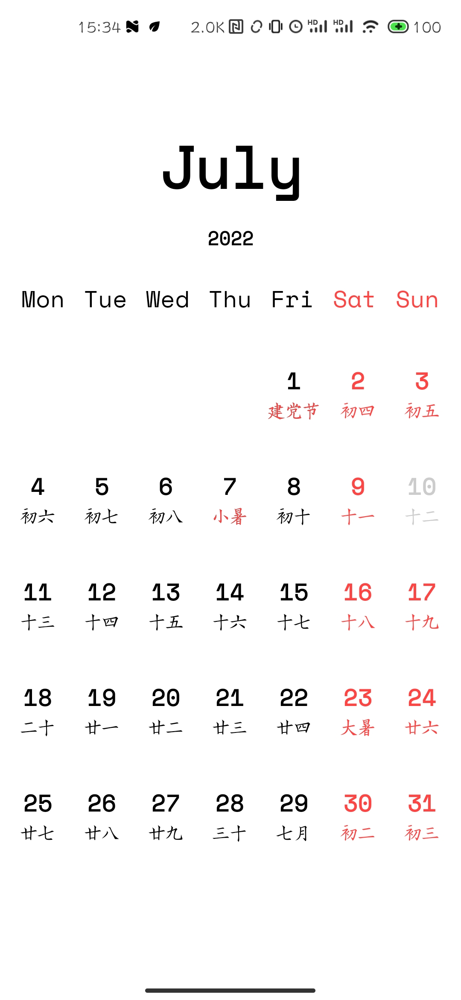
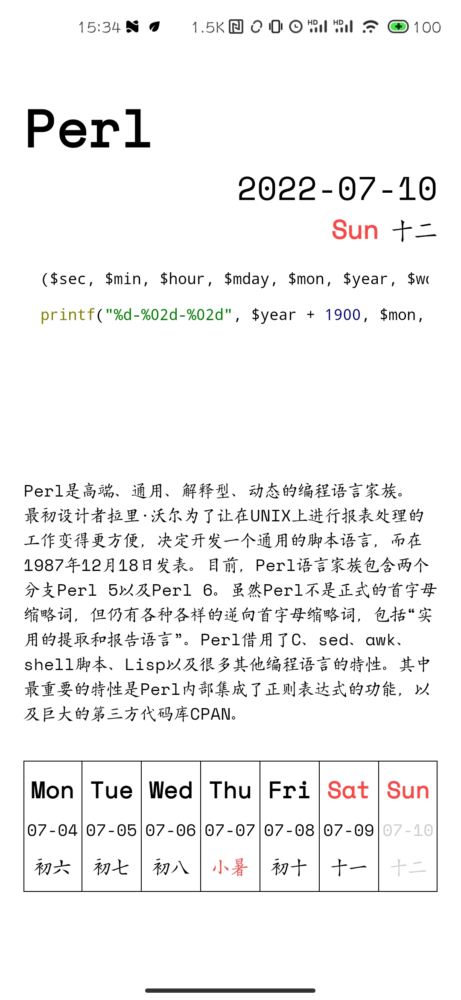
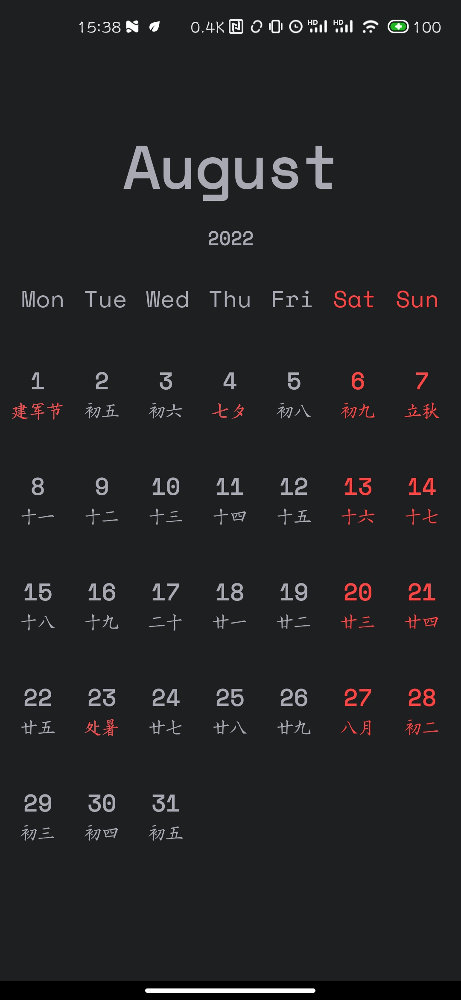
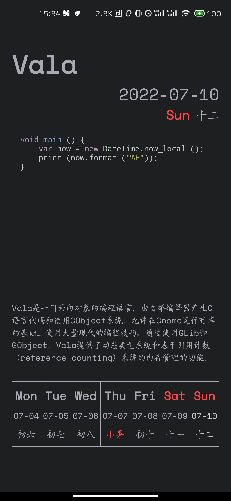

# Open Happy Hacking Calendar（编程日历）

编程日历app，java 实现，[OpenHappyHackingCalendar-Python](https://github.com/Yifeng-J/OpenHappyHackingCalendar-Python) 项目作为灵感来源，一时兴起写的项目

## 截图（Screenshots）

白天模式：

 

暗黑模式：

 

## 安装（Install）

[Releases](https://github.com/lsilencej/OpenHappyHackingCalendar/releases/latest)
[酷安](https://www.coolapk.com/apk/296876)

## 感谢（Grateful）

- [com.github.angcyo:CalendarView](https://github.com/angcyo/CalendarView)
- [com.google.code.gson:gson](https://github.com/google/gson)
- [thereisnospon.codeview:codeview](https://github.com/Thereisnospon/CodeView)
